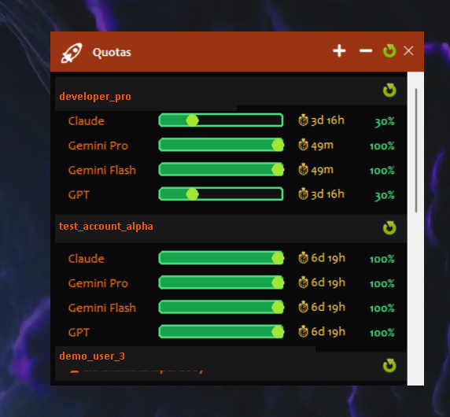

<div align="center">
  
  <br />
  
  # antigravity-multi-account-tracker

  <p align="center">
    
    
    
    
  </p>

  <p>A sleek, lightweight, neon-themed desktop widget for tracking your Google Antigravity API quotas across multiple accounts in real-time.</p>
  <p><em>Inspired by <a href="https://www.npmjs.com/package/antigravity-usage">antigravity-usage</a></em></p>
</div>

<br />

## 📸 Preview



---

## ✨ Features

🔥 **Multi-Account Dashboard**  
Track quotas for multiple Google accounts side by side natively on your Windows desktop. 

⏱️ **Live Countdown Timers**  
Real-time ticking countdown showing exactly when each model's quota resets (auto-adjusts between daily and weekly limits).

🔄 **Animated Refresh**  
Click the global refresh and watch it sequentially animate through each account, or refresh accounts individually.

🎨 **Modern Neon UI**  
Beautiful, distraction-free aesthetic with a Dark Onyx background, Deep Orange title bar, and dynamic Neon Green progress bars.

🛡️ **Thread-Safe & Secure**  
- **Zero shell injection:** All subprocess calls use strict argument lists.
- **Fail-safe timeouts:** 20-second timeout prevents permanent app lockups.
- **Local auth only:** Your tokens never touch this app; authentication remains securely sandboxed inside the official Antigravity CLI.

---

## 🚀 Quick Start

### 1. Prerequisites
You must have Python installed and the official Antigravity CLI configured on your system:
```bash
antigravity-usage accounts add
```

### 2. Download
Clone this repository to your local machine:
```bash
git clone https://github.com/shree-node/antigravity-multi-account-tracker.git
cd antigravity-multi-account-tracker
```

### 3. Launch
No `pip install` required. It uses the Python standard library.
```bash
# Option A: Just double-click launch.bat!

# Option B: Run from terminal
python quota_widget.py
```

---

## 🎨 UI Color Reference

| Element | Color | Hex Code |
|---|---|---|
| Background | Midnight Onyx | `#09090B` |
| Title Bar | Dark Orange | `#9A3412` |
| Model Labels | Bright Orange | `#F97316` |
| Progress Bars | Neon Green | `#4ADE80` |
| Quota Warning | Red | `#EF4444` |
| Reset Timer | Amber Yellow | `#FCD34D` |

---

## ⚠️ Known Limitations

- **Unverified / Free Accounts:** Due to a known bug in the upstream `antigravity-usage` CLI, adding an account without a valid subscription or one that fails verification will still cache a "dummy" profile locally. The CLI will falsely report this broken account as having 100% quotas available. 
  - **Workaround:** If you add a bad account and hit a "Verification Required" wall in your browser, simply click the **➖ (Remove)** button on the widget and type the email address to delete it from your cache.

---

## 🤝 Contributing

Pull requests are welcome! Potential future features:
- Linux/macOS support
- Auto-start on Windows login
- Notification alerts when quota drops below 10%

---

## ☕ Support

If this tool saves you time, consider buying me a coffee!

[](https://ko-fi.com/)

---

## 📜 License

MIT License — see [LICENSE](LICENSE) for details.

> **Disclaimer:** This is an unofficial community tool. Not affiliated with or endorsed by Google.
